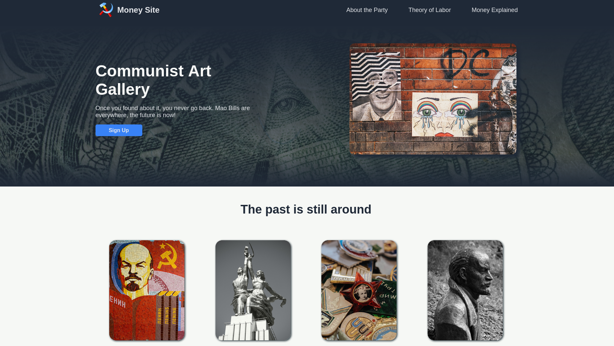

 
<h1>Landing Page — Odin </h1>

Please take it with a grain of salt. I was having <em>too much fun.</em>

<em></em>

 
## Introduction

This is my second project overall, also coming from the [Odin Project Curriculum](https://www.theodinproject.com/lessons/foundations-landing-page).
I'm rather someone with a lot of original and creative ideas, so for me the top goal on this proyect was to stick to the design template. See: [reference](./reference-images) 

## Self impose Goals

- ✅ Faithful to the original design template
- ✅ Decent Mobile responsiveness from flexbox & media queries
- ✅ Sticky Navbar with seamless gradient
- ✅ Navbar #links aligns with containers
- ✅ Fix background & fix section background
- ✅ Pleasently looking box-shadows & regions opacity
- ✅ Sign-up button takes to 404 page

## To-do list:
- ⏳ Draggable and inertia based images and single letter pool-like fisics
- ⏳ Add alternative color palette

## [Images Credits](./credits.md)

The images displayed in this collection are not owned or copyrighted by me. They belong to their respective creators and rights holders. If you believe your copyright has been infringed, please contact me with proof of ownership and I will take them down.
